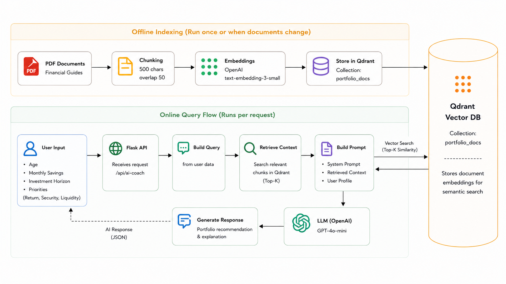
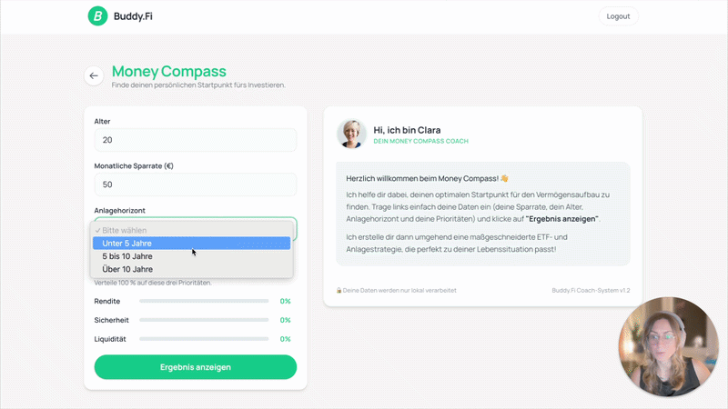

# Money Compass Service API

RAG-powered investment recommendation API built with Flask, OpenAI, LangChain, and Qdrant.

The system transforms structured financial user inputs into personalized portfolio recommendations by combining Retrieval-Augmented Generation (RAG), financial knowledge documents, and LLM-based reasoning.

---

## Architecture Overview

<p align="center">
  
</p>

---

## Demo

<p align="center">
  
</p>

<p align="center">
  <a href="https://www.loom.com/share/c255ca2a9a404d3c8bb2b502bffd2034">
    ▶ Watch Product Demo (4 min)
  </a>
</p>

---

## Overview

Money Compass was built to explore how Retrieval-Augmented Generation (RAG) can be applied to personal finance education.

The API combines:
- Structured financial user input
- Financial knowledge documents
- Semantic search with Qdrant
- OpenAI embeddings
- LLM-generated portfolio explanations

The goal is to translate financial concepts into simple, actionable recommendations for beginners.

---

## How It Works

### Offline Indexing

1. Load portfolio guide PDFs
2. Split documents into chunks
3. Create embeddings using OpenAI
4. Store vectors in Qdrant

### Online Query Flow

1. Receive user profile data
2. Build a natural-language query
3. Retrieve relevant document chunks from Qdrant
4. Combine retrieved context with a system prompt
5. Generate a response using GPT-4o-mini
6. Return a personalized portfolio recommendation

---

## Features

- Retrieval-Augmented Generation (RAG)
- Semantic search with Qdrant
- OpenAI Embeddings (`text-embedding-3-small`)
- GPT-4o-mini response generation
- Financial knowledge retrieval from PDF documents
- REST API built with Flask
- Configurable system prompts
  
---

## API Endpoints

```text

POST   /api/ai-coach
GET    /api/ai-coach
GET    /api/ai-coach/welcome
GET    /health

```
---

## Project Structure

```text
money_compass/
│
├── api.py
├── rag_service.py
├── requirements.txt
├── .env
│
├── prompts/
│   └── system_prompt.txt
│
├── data/
│   ├── ausgewogenes_portfolio.pdf
│   ├── sicherheitsorientiertes_portfolio.pdf
│   └── wachstumsorientiertes_portfolio.pdf
│
└── assets/
    ├── money_compass_architecture.png
    └── money_compass_demo.gif
```

---

## Tech Stack

- Python
- Flask
- LangChain
- OpenAI
- Qdrant
- PyMuPDF
- dotenv

---

## Local Development

Install dependencies:

```bash
pip install -r requirements.txt
```

Create a `.env` file:

```dotenv
SECRET_KEY_OPENAI=your-key
SECRET_KEY_QDRANT=your-key
```

Start the API:

```bash
python api.py
```

Default port:

```text
http://localhost:5004
```

